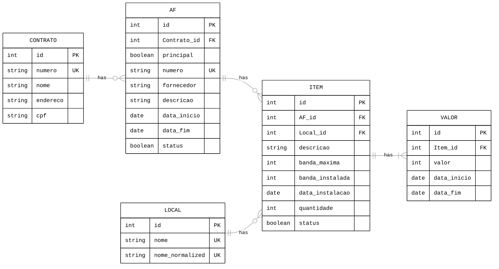

# Sistema de Gestão de Autorizações de Fornecimento

## ER model

```mermaid
%%{init: {'theme': 'base', 'themeVariables': {'fontFamily': 'monospace', 'primaryColor': '#ffffff', 'primaryTextColor': '#000000', 'primaryBorderColor': '#000000', 'lineColor': '#888888', 'secondaryColor': '#ffffff', 'tertiaryColor': '#ffffff', 'background': '#ffffff'}}}%%
erDiagram
	direction LR
	CONTRATO {
		int id PK
		string numero UK
		string nome
		string endereco
		string cpf
	}
	AF {
		int id PK
		int Contrato_id FK
		boolean principal
		string numero UK
		string fornecedor
		string descricao
		date data_inicio
		date data_fim
		boolean status
	}
	LOCAL {
		int id PK
		string nome UK
		string nome_normalized UK
	}
	ITEM {
		int id PK
		int AF_id FK
		int Local_id FK
		string descricao
		int banda_maxima
		int banda_instalada
		date data_instalacao
		int quantidade
		boolean status
	}
	VALOR {
		int id PK
		int Item_id FK
		int valor
		date data_inicio
		date data_fim
	}
	CONTRATO ||--o{ AF : has
	AF ||--o{ ITEM : has
	LOCAL ||--o{ ITEM : has
	ITEM ||--|{ VALOR : has
```
